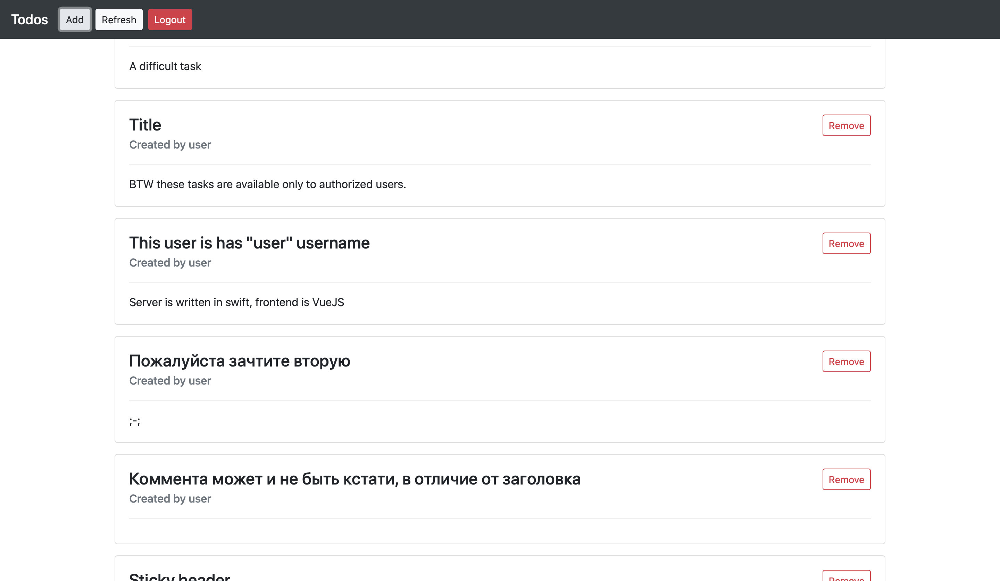

# SPP Labs

Все лабы, кстати, делаю сам, сейчас очень большая загрузка, не хочется разбираться с деплоем JS, поэтому видео есть в репозитории, скриншоты основных экранов есть тут, в ридми.

Но у меня есть пара задеплоеных черновиков

https://makeupstudio.herokuapp.com

https://mxswift.herokuapp.com

Они полностью написаны на Swift, пока нет времени доводить их до ума, но я пишу свое решение для фронтенда на свифте, надеюсь будет плюсиком в карму.

А еще с 15 мая начал ревьюить эту книгу (ну вычитывать на наличие ошибок) 🌚

https://theswiftdev.com/practical-server-side-swift-using-vapor-4-book/

> _Репозиторий приватный, так как делаю в спешке и не слежу за чистотой кода, не хочу это в паблик выкладывать))_
> _Хотя GenericController отполирую и выложу на [gist](https://gist.github.com/maximkrouk), наверное_
## Первая

> **Сдал очно**

## Вторая

> Tag `2.0.0`

Тут немного, но это SPA с авторизацией через токены (просто токены)

