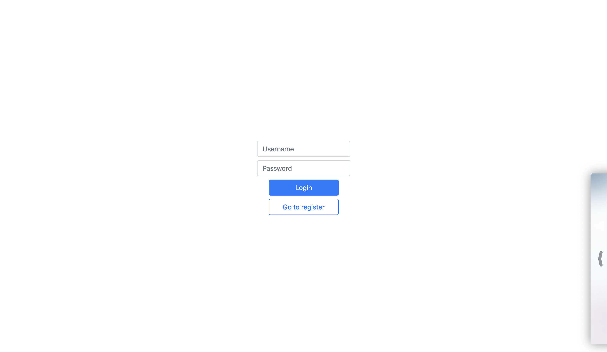
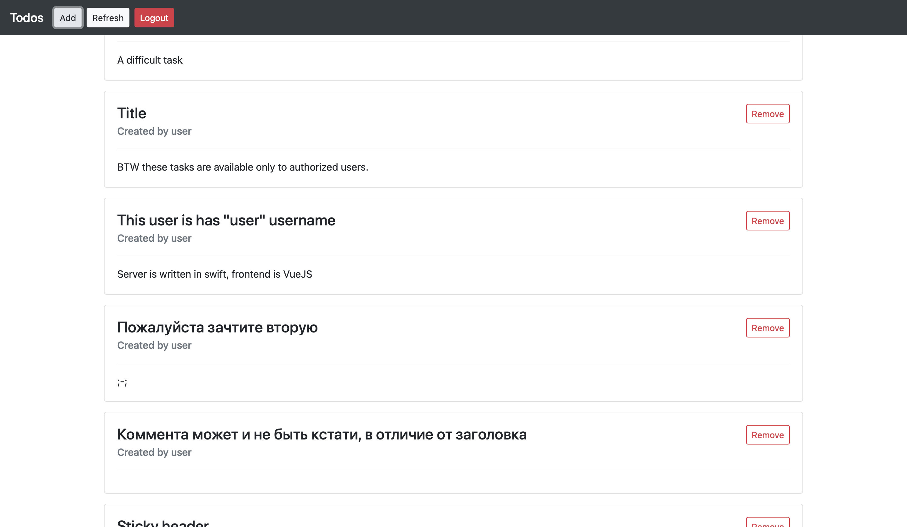
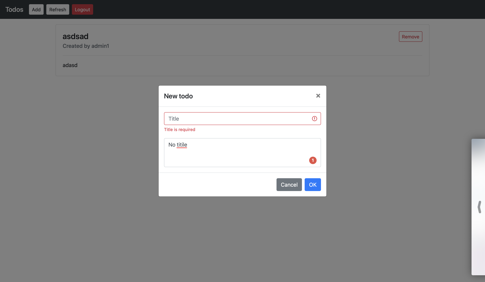
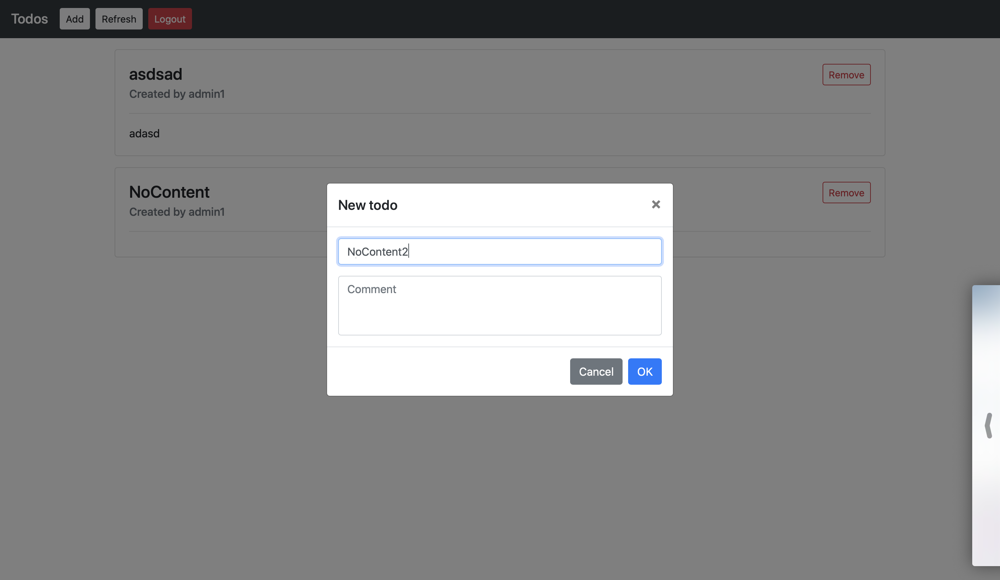

# SPP Labs

Все лабы, кстати, делаю сам, сейчас очень большая загрузка, не хочется разбираться с деплоем JS, поэтому видео есть в репозитории, скриншоты основных экранов есть тут, в ридми.

Но у меня есть пара задеплоеных черновиков

https://makeupstudio.herokuapp.com

https://mxswift.herokuapp.com

Они полностью написаны на Swift, пока нет времени доводить их до ума, но я пишу свое решение для фронтенда на свифте, надеюсь будет плюсиком в карму.

А еще с 15 мая начал ревьюить эту книгу (ну вычитывать на наличие ошибок) 🌚

https://theswiftdev.com/practical-server-side-swift-using-vapor-4-book/


> _Репозиторий приватный, так как делаю в спешке и не слежу за чистотой кода JS, пока не хочу это в паблик выкладывать))_
> _Хотя GenericController выложил на [gist](https://gist.github.com/maximkrouk/7dccc660f917e634b3b6cfea006e5cee)_


Инструкция по запуску

```swift
// BACKEND
> Открыть ./todos-backend/Package.swift в Xcode
> Подождать пока подтянутся зависимости
> В продублировать схему `todos`
> Задать аргумент запуска `--auto-migrate`
> Запустить новую схему

// FRONTEND
> Открыть ./todos-frontend в терминале
> Выполнить команду `npm run serve`

// BROWSER
> Backend будет работать на http://localhost:8080
> Frontend будет работать на http://localhost:8081

> Зайти на http://localhost:8081
```

## Первая ✅

> **Сдал очно**

Сервер на Swift ([Vapor](https://vapor.codes)) рендеринг фронтенда на сервере при помощи моего фреймворка [Makeup](https://github.com/makeupstudio/makeup)

## Вторая ✅

> Tag `2.0.0`

SPA

- Backend: Swift (Vapor)
- Frontend: **VueJS**
- Auth: **Token (Bearer)**

## Третья ✅

> Tag `3.0.0`

SPA

- Backend: Swift (Vapor)
- Frontend: VueJS
- Auth: **JWT**

## Четвертая

> `in progress`

SPA

- Backend: Swift (Vapor) + **WebSockets**
- Frontend: VueJS + **WebSockets**
- Auth: JWT

## Пятая

> `in progress`

SPA

- Backend: Swift (Vapor) + **GraphQL**
- Frontend: VueJS
- Auth: JWT

## Скриншоты

> Register

----


----


> Login

----



----


> Main

----



----


> Add todo with no title ❌

----



----


> Add todo with no content ✅

----



